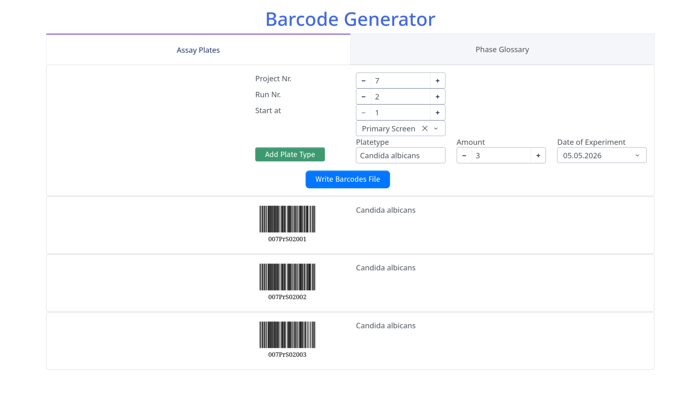

# BarcodeGenerator
Intended to be used with AnalytikJena's barcode printer program.

Generates two CSV files containing 10 columns each.

1) `<ProjectNr><Screentype><RunNr>barcodes<date>.csv`

| Barcode     | ProjectNr | PlateNr | Phase          | PhaseID | RunNr | Date     | Info             |
|-------------|-----------|---------|----------------|---------|-------|----------|------------------|
| 007PrS02001 | 7         | 1       | Primary Screen | PrS     | 2     | 20260505 | Candida albicans |
| 007PrS02002 | 7         | 2       | Primary Screen | PrS     | 2     | 20260505 | Candida albicans |
| 007PrS02003 | 7         | 3       | Primary Screen | PrS     | 2     | 20260505 | Candida albicans |

2) `<ProjectNr><Screentype><RunNr>cybio_barcodes<date>.csv`

| Barcode     | value1 | value2 | value3         | value4 | value5 | value6           | value7 | value8 | value9 |
|-------------|--------|--------|----------------|--------|--------|------------------|--------|--------|--------|
| 007PrS02001 | 7      | 1      | Primary Screen | PrS    | 2      | Candida albicans | 260505 |        |        |
| 007PrS02002 | 7      | 2      | Primary Screen | PrS    | 2      | Candida albicans | 260505 |        |        |
| 007PrS02003 | 7      | 3      | Primary Screen | PrS    | 2      | Candida albicans | 260505 |        |        |

## Usage
Change directory to BarcodeGenerator and run in terminal:
```Sh
uv run --locked main.py
```

The above command starts the webapp. **Dont close the terminal!**


